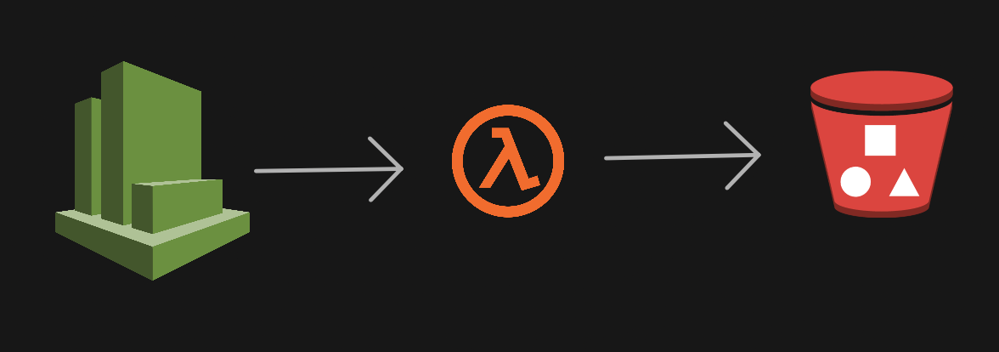

# CloudWatch Logs to S3 Bucket (cold storage)



**Pre-Requisities**

We will need the following pre-requisites to successfully complete this activity,

### **S3 Bucket Configuration:**

1. **Create an S3 Bucket:**
    - Open the AWS Management Console and navigate to S3.
    - Click "Create Bucket" and follow the prompts to create your S3 bucket.
2. **Update Bucket Policy:**
    - Edit the bucket policy and grant necessary permissions.

Below is a sample policy:

```jsx
{
    "Version": "2008-10-17",
    "Id": "Policy1335892530063",
    "Statement": [
        {
            "Effect": "Allow",
            "Principal": {
                "Service": "logs.YOUR-REGION.amazonaws.com"
            },
            "Action": "s3:GetBucketAcl",
            "Resource": "arn:aws:s3:::YOUR-BUCKET-NAME"
        },
        {
            "Effect": "Allow",
            "Principal": {
                "Service": "logs.YOUR-REGION.amazonaws.com"
            },
            "Action": "s3:PutObject",
            "Resource": "arn:aws:s3:::YOUR-BUCKET-NAME/*",
            "Condition": {
                "StringEquals": {
                    "s3:x-amz-acl": "bucket-owner-full-control"
                }
            }
        }
    ]
}
```

Ensure to replace **`your-bucket-name`** with the actual name of your S3 bucket.

### **IAM Role Configuration:**

1. **Create IAM Role:**
    - Access the IAM console.
    - Click "Roles" and then "Create Role".
    - Select "AWS Lambda" as the service.
    - Attach the **`AWSLambdaExecute`** managed policy.
2. **Add Inline Policy (ListBucketPolicy):**
    - In the IAM role, go to the "Permissions" tab.
    - Click "Attach policies" and choose "Add inline policy".
    - Use the following JSON for the inline policy:
    
    ```jsx
    {
        "Version": "2012-10-17",
        "Statement": [
            {
                "Effect": "Allow",
                "Action": [
                    "s3:ListBucket",
                    "s3:HeadBucket"
                ],
                "Resource": "*"
            }
        ]
    }
    ```
    
    Replace **`your-bucket-name`** with the actual name of your S3 bucket.
    
    ### **CloudWatch Log Group Setup:**
    
    **Create CloudWatch Log Group:**
    
    - Navigate to the CloudWatch console.
    - Click on "Logs" and then "Create Log Group".
    - Provide a name for your log group.
    
    ## ⚙️ **Configure Lambda Function**
    
    Below are the steps to configure a Lambda function using Python 3.7 and attaching the IAM role:
    
    ### **Lambda Function Configuration:**
    
    1. **Create Lambda Function:**
        - Go to the AWS Lambda console.
        - Click on "Create function" and choose "Author from scratch".
        - Provide a name for your function, e.g., "CloudWatchLogsToS3Exporter".
        - Choose "Python 3.7" as the runtime.
    2. **Attach IAM Role:**
        - In the "Execution role" section, choose "Use an existing role".
        - From the dropdown, select "cw-to-s3-exporter-role".
    3. **Save the Lambda Function:**
        - Paste or upload your Python code into the Lambda function editor.
        - Click on "Save" in the upper-right corner to save your Lambda function configuration.

## ⚙️**Configure Lambda Triggers with CloudWatch Event Rules:**

1. **Navigate to CloudWatch Dashboard:**
    - Open the AWS Management Console and go to the CloudWatch dashboard.
2. **Create a New Rule:**
    - In the CloudWatch dashboard, select "Rules" from the left navigation pane.
    - Click on "Create rule" to start configuring a new rule.
3. **Choose Schedule:**
    - In the "Event Source" section, choose "Event Source Type" as "Schedule".
    - For "Fixed rate of", provide the schedule interval. You can also use a cron expression for more advanced schedules.
4. **Configure Target - Lambda Function:**
    - In the "Targets" section, choose "Lambda function" as the target.
    - From the dropdown menu, select your Lambda function name.
5. **Configure Details:**
    - Scroll down to the "Configure Details" section.
    - Provide a meaningful "Name" and "Description" for your rule.
6. **Enable the Rule:**
    - Ensure that the rule is "Enabled". This allows the rule to be active and trigger the Lambda function.
    - Enable the trigger by checking the box for "Enable rule".
7. **Save the Configuration:**
    - Click on "Save" to save your CloudWatch Event Rule configuration.

Now, your Lambda function should be triggered based on the schedule you defined in the CloudWatch Event Rule.